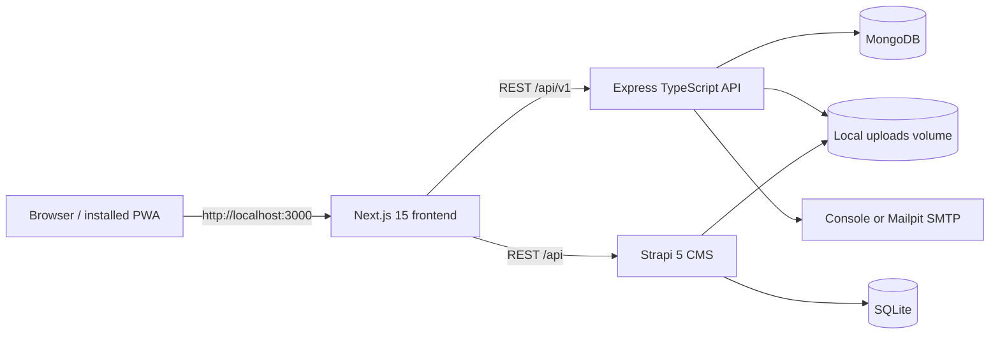

# System architecture

## Context

CITIS InfoTech is an installable Next.js PWA backed by two independent local services:

- The Express API owns authentication, operational records, form submissions, media uploads, and
  the MongoDB-backed application models.
- Strapi owns editor-managed website content and its media library. It uses SQLite locally.

**No paid third-party services are required.** Media is stored on local disk. Email uses a
console/json transport by default, or the free Mailpit container included in Compose. Maps use
OpenStreetMap embeds (no API key).

Strapi and MongoDB are not synchronized automatically. Choose one system of record for each
content family before integrating a page; do not write the same editorial item to both services.

## Request flows

### Public page

1. The browser requests a route from Next.js.
2. A server component may fetch published content from Strapi. Next.js caches eligible requests
   and uses content-specific cache tags.
3. Interactive forms submit to the Express `/api/v1` endpoints.
4. The response is rendered as HTML and hydrated in the browser.

### Authentication

1. A user registers or signs in through `/api/v1/auth`.
2. The API validates input, looks up the user in MongoDB, and issues short-lived access and
   long-lived refresh JWTs.
3. Tokens are returned through HTTP-only cookies; login also returns an access token for Bearer
   clients.
4. Protected routes authenticate the token and apply role-based authorization.

### Editorial publishing

1. An editor signs in to the Strapi admin at `/admin`.
2. The editor creates a draft, adds media, reviews it, and publishes it.
3. Public Strapi permissions or a read-only API token allow Next.js to fetch published records.
4. Cached Next.js content refreshes at its configured revalidation interval.

## Boundaries and ports

| Component | Local port | Notes |
| --- | ---: | --- |
| Next.js | 3000 | Marketing site + admin UI + PWA |
| Express API | 5000 | Auth, forms, media, analytics |
| Static uploads | 5000 `/uploads` | Local disk served by Express |
| Strapi | 1337 | Editorial CMS |
| MongoDB | 27017 | Application data |
| Mailpit UI (optional) | 8025 | View captured emails locally |
| Mailpit SMTP (optional) | 1025 | Free local SMTP |

## Reliability and security (local)

- Keep JWT secrets at least 32 characters even on localhost.
- Do not commit `.env` files; use the provided `.env.example` templates.
- Uploads live under `backend/uploads/` (gitignored) or a Docker volume.
- Restrict Strapi Public role to `find` / `findOne` only for published content.
